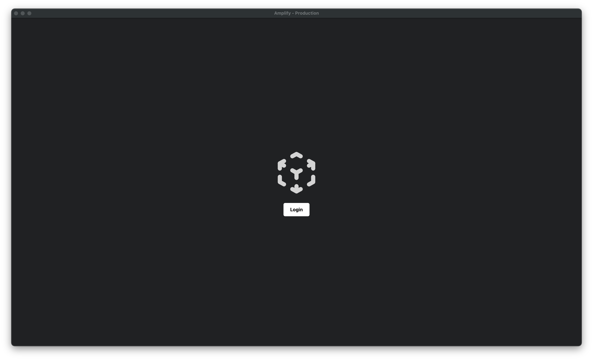
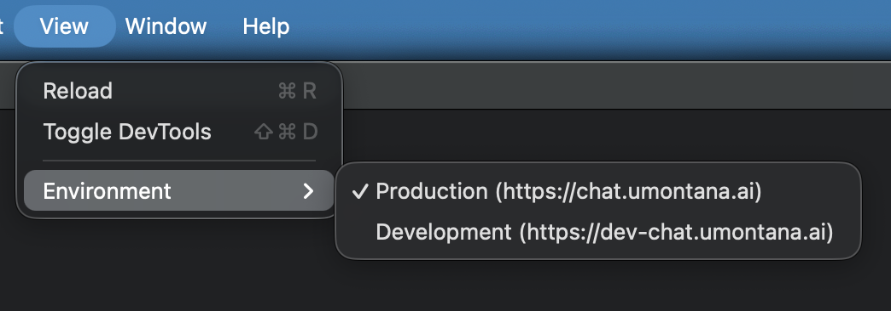
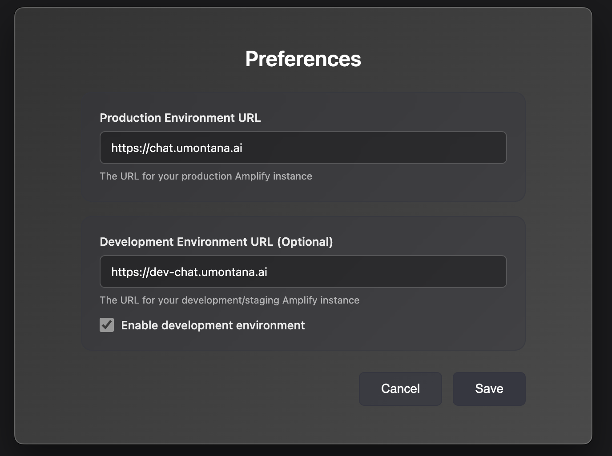
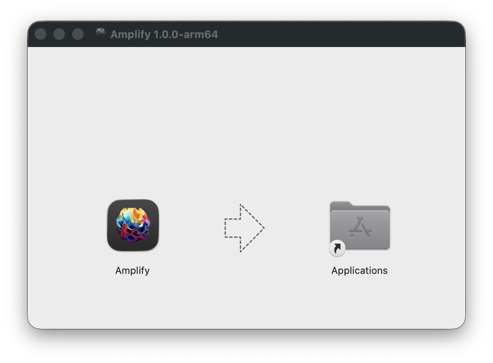

# Amplify - Desktop Application

[](https://github.com/umzcio/Amplify-Desktop-Client/releases)
[](LICENSE)
[](https://github.com/umzcio/Amplify-Desktop-Client/releases)
[](https://www.electronjs.org/)

Desktop wrapper for University of Montana's implementation of Amplify, providing a native desktop experience with persistent sessions and seamless environment switching.



## Table of Contents
- [Download](#download)
- [About Amplify](#about-amplify)
- [Features](#features)
- [Quick Start](#quick-start)
- [Development](#development)
- [Usage](#usage)
  - [Environment Switching](#environment-switching)
  - [Preferences](#preferences)
  - [Keyboard Shortcuts](#keyboard-shortcuts)
  - [Login Sessions](#login-sessions)
- [Distribution](#distribution)
  - [macOS Installation](#macos-installation)
  - [Windows Installation](#windows-installation)
- [Troubleshooting](#troubleshooting)
- [Technical Details](#technical-details)
- [Project Structure](#project-structure)
- [Acknowledgments](#acknowledgments)
- [Support](#support)

---

## Download

**Latest Release: [v1.0.0](https://github.com/umzcio/Amplify-Desktop-Client/releases/latest)**

| Platform | Download |
|----------|----------|
| 🍎 **macOS** (Apple Silicon) | [Amplify-1.0.0-arm64.dmg](https://github.com/umzcio/Amplify-Desktop-Client/releases/download/v1.0.0/Amplify-1.0.0-arm64.dmg) |
| 🪟 **Windows** (Installer) | [Amplify Setup 1.0.0.exe](https://github.com/umzcio/Amplify-Desktop-Client/releases/download/v1.0.0/Amplify.Setup.1.0.0.exe) |
| 🪟 **Windows** (Portable) | [Amplify 1.0.0.exe](https://github.com/umzcio/Amplify-Desktop-Client/releases/download/v1.0.0/Amplify.1.0.0.exe) |

> 📦 View all releases and release notes: [Releases Page](https://github.com/umzcio/Amplify-Desktop-Client/releases)

---

## About Amplify

**Amplify** is Vanderbilt University's open-source enterprise platform for generative AI, designed to empower organizations with the ability to innovate across disciplines. By offering a flexible and cost-efficient chat-based interface, Amplify allows users to experiment with and deploy generative AI solutions tailored to their specific needs.

Its architecture supports vendor independence, ensuring that users can select and switch between a variety of AI models, such as those from OpenAI and Anthropic, without being locked into a single provider.

Learn more at [AmplifyGenAI.org](https://www.amplifygenai.org/)

### University of Montana Implementation

The University of Montana has implemented Amplify as its flagship generative AI tool, providing faculty, staff, and students with powerful AI capabilities. This desktop application was developed by UM to deliver an enhanced native experience to end-users, with persistent SAML SSO sessions and seamless environment switching between production and development instances.

## Features

- 🖥️ **Native Desktop Experience** - Built with Electron for macOS and Windows
- 🔐 **Persistent SAML SSO** - Login sessions saved automatically, no repeated authentication
- 🔄 **Environment Switching** - Seamlessly switch between Production and Development
- ⚙️ **Configurable URLs** - Customize environment URLs via Preferences (reusable by other institutions)
- 🔔 **Auto-Update Notifications** - Automatic update checks with GitHub Releases integration
- 💾 **Window State Persistence** - Remembers size, position, and environment preference
- 🎨 **Beautiful Custom Dialogs** - Professional About, Preferences, and Update dialogs
- 🔒 **Security First** - Context isolation, disabled node integration, separate session partitions
- 🌐 **Isolated Cookie Storage** - Each environment maintains separate login sessions
- ⌨️ **Keyboard Shortcuts** - Quick access to all features via familiar shortcuts

## Quick Start

### Installation

1. Install dependencies:
```bash
npm install
```

2. Run the app:
```bash
npm start
```

## Development

### Running the App
```bash
npm start
```

### Building for Distribution

Build for both macOS and Windows:
```bash
npm run build
```

Build for macOS only:
```bash
npm run build:mac
```

Build for Windows only:
```bash
npm run build:win
```

Built applications will be in the `dist/` folder:
- **macOS**: `Amplify-1.0.0-arm64.dmg` and `Amplify-1.0.0-arm64-mac.zip`
- **Windows**: `Amplify Setup 1.0.0.exe` (installer) and `Amplify 1.0.0.exe` (portable)

## Usage

### Environment Switching

Switch between Production and Development environments using:
- Menu: **View → Environment** → Select environment
- Keyboard: `Cmd/Ctrl+E` to open environment menu



**Available Environments:**
- Production: https://chat.umontana.ai
- Development: https://dev-chat.umontana.ai

### Preferences

Configure custom environment URLs via **Amplify → Preferences** (or `Cmd/Ctrl+,`):



### Keyboard Shortcuts

- `Cmd/Ctrl+R` - Reload page
- `Cmd/Ctrl+Q` - Quit application
- `Cmd/Ctrl+Shift+D` - Toggle Developer Tools
- `Cmd/Ctrl+E` - Open environment switcher menu

### Login Sessions

- Login sessions are automatically saved and persist between app launches
- Each environment (Production/Development) has its own separate login session
- Cookies are stored securely in the app's user data directory

## Project Structure

```
Amplify-Mac-Desktop/
├── package.json          # Dependencies and build config
├── main.js              # Main Electron process
├── preload.js           # Preload script for security
├── assets/
│   ├── icon.png         # Base icon (1024x1024)
│   ├── icon.icns        # macOS icon
│   └── icon.ico         # Windows icon
└── README.md            # This file
```

## Technical Details

### Built With
- [Electron](https://www.electronjs.org/) - Desktop app framework
- [electron-store](https://github.com/sindresorhus/electron-store) - Settings persistence
- [electron-builder](https://www.electron.build/) - Build and packaging

### Security Features
- Context isolation enabled
- Node integration disabled
- Separate session partitions for prod/dev
- External links open in default browser

### Data Storage
- Settings stored in: `~/Library/Application Support/amplify-client` (macOS)
- Settings stored in: `%APPDATA%/amplify-client` (Windows)
- Includes: environment preference, window bounds, session cookies

## Distribution

### macOS Installation
1. Download the DMG file (`Amplify-1.0.0-arm64.dmg`)
2. Open the DMG
3. Drag "Amplify" to Applications folder



4. **Right-click** the app and choose "Open" the first time (to bypass Gatekeeper)
5. Click "Open" in the security dialog

### Windows Installation
1. Download the installer `.exe` file
2. Run the installer
3. Follow installation prompts (may need to allow in SmartScreen)
4. Launch from Start Menu or Desktop shortcut

## Troubleshooting

### App won't open on macOS
- Go to System Preferences → Security & Privacy
- Click "Open Anyway" if the app was blocked

### Lost login session
- Ensure you're in the correct environment (Production vs Development)
- Try logging in again - the session will be saved automatically

### Need to clear all data
- Close the app
- Delete the settings folder:
  - macOS: `~/Library/Application Support/amplify-client`
  - Windows: `%APPDATA%/amplify-client`

## License

MIT

## Acknowledgments

This desktop application is built for the University of Montana's implementation of **Amplify**, an open-source platform developed by Vanderbilt University.

- **Amplify Platform**: Developed and maintained by Vanderbilt University
- **Project Homepage**: [AmplifyGenAI.org](https://www.amplifygenai.org/)
- **Source Repository**: [github.com/vanderbilt-data-science/amplify](https://github.com/vanderbilt-data-science/amplify)

We thank Vanderbilt University for creating and open-sourcing Amplify, enabling institutions like the University of Montana to provide powerful generative AI capabilities to their communities.

## Support

For issues or questions, contact University of Montana IT support.
